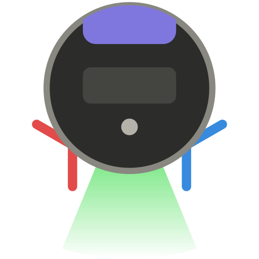

<p align="center">
  
</p>

# DySS Cockpit

*English: see the [English summary](#english-summary).*

**DySS Cockpit** est une application Windows non officielle pour piloter le robot aspirateur et laveur **Dyson Spot+Scrub AI** (nom interne RB05) : nettoyer des pièces ou une zone, suivre le robot en direct sur la carte, gérer cartes, pièces, zones et horaires, consulter l'historique. Son nom vient de **Dy**son **S**pot+**S**crub.

Le robot sur le site de Dyson : [présentation](https://www.dyson.ch/fr_ch/aspirateurs/robot/spot-scrub-ai) et [fiche technique](https://www.dyson.ch/fr_ch/aspirateurs/robot/spot-scrub-ai/noir) en français ; [présentation](https://www.dyson.com/vacuum-cleaners/robot/spot-scrub-ai) et [fiche technique](https://www.dyson.com/vacuum-cleaners/robot/spot-scrub-ai/black) en anglais.

> **Projet indépendant, non affilié à Dyson, ni approuvé ou soutenu par Dyson.** Il s'appuie sur une API non documentée, retrouvée par rétro-ingénierie à des fins d'interopérabilité, qui peut changer à tout moment : à utiliser à vos risques. Dyson, Spot+Scrub et MyDyson sont des marques du groupe Dyson, citées ici uniquement pour désigner le robot et l'application avec lesquels ce logiciel communique.

> Ce README, comme l'essentiel du code de ce dépôt, a été rédigé par Claude (Claude Code, Anthropic), sous la direction d'Armand Delessert.

## English summary

**DySS Cockpit** is an unofficial Windows application for the **Dyson Spot+Scrub AI** robot vacuum and mop (RB05). It talks to the robot through Dyson's cloud, with the same MyDyson account as the phone app: clean rooms or a zone drawn on the map, follow the robot live, manage maps, rooms, no-go zones, furniture and schedules, browse the cleaning history. It keeps running in the notification area and raises Windows notifications. The interface is in French or English.

- **Install**: download the zip of the [latest release](https://github.com/ArmandDelessert/dyson-spot-scrub-windows/releases/latest) for x64 or ARM64, unzip it and run `DyssCockpit.exe` (not signed: SmartScreen asks once). Sign in with your MyDyson account (email, password, then a one-time code). Requires Windows 10 version 2004 or later, or Windows 11.
- **Unofficial**: the API was reverse-engineered from the Android app, for interoperability, and may change at any time. Use at your own risk. Not affiliated with, endorsed or supported by Dyson.
- **For developers**: the protocol is documented in [docs/protocole.md](docs/protocole.md), in French; its JSON payloads and tables read without translation. The key finding: the custom-authorizer token of `POST /v2/authorize/iot-credentials` only allows publishing commands when it is given as the MQTT username, on a direct TLS connection to port 443 with ALPN `mqtt`, the official app's transport. Over MQTT on WebSocket, the same token can subscribe but not publish (see [Comment ça marche](#comment-ça-marche)).
- **License**: [MIT](LICENSE).

## Sommaire

- [Fonctionnalités](#fonctionnalités)
- [Installation](#installation)
- [Limites connues](#limites-connues)
- [Comment ça marche](#comment-ça-marche)
- [Développement](#développement)
- [Références](#références)
- [Avertissements](#avertissements)
- [Licence](#licence)

## Fonctionnalités

L'application parle au robot comme l'application mobile MyDyson, avec le même compte. Tout ce qui est modifié ici se retrouve sur le téléphone, et inversement. Elle a l'apparence de Windows 11 (Mica, contrôles Fluent), suit son thème clair ou sombre, et range ses pages dans un volet de navigation : tableau de bord, historique, horaires, réglages, journal et gestion des cartes. Elle parle français ou anglais : la langue de Windows par défaut, ou celle choisie dans l'en-tête.

### Tableau de bord

- **État du robot** : état en clair, batterie, fautes, et ce que fait la station (vidage, lavage, séchage avec le temps restant). Le retour à la station pour laver le rouleau en cours de nettoyage est signalé, ce que l'application officielle ne fait pas. Boutons « Pause » / « Reprendre » et « Retour à la station ».
- **Nettoyer des pièces** : choix de la carte (et de la carte active du compte), pièces cochées dans la liste ou cliquées sur la carte, dans l'ordre de passage voulu. Chaque pièce a ses réglages : type de nettoyage (aspirer, laver, ou les deux), mode d'aspiration, niveau d'eau et nombre de passages. Ils sont enregistrés sur le compte, comme sur le téléphone.
- **Nettoyer une zone** : un rectangle tracé sur la carte en cliquant deux coins opposés, puis déplacé ou redimensionné à la souris, nettoyé avec son propre type, sa puissance, son eau et ses passages. Un clic dans le vide de la carte ou la touche Échap l'efface.
- **Station** : « Vider le collecteur » et « Laver et sécher », qui devient l'arrêt de l'action en cours.
- **Consommables** : durée de vie restante de chaque pièce d'usure.
- **Notifications Windows**, même fenêtre fermée : à la fin du nettoyage (avec sa durée), et, au choix, à son début (avec les pièces lancées depuis l'application) ; quand le robot abandonne son nettoyage (« Nettoyage interrompu ») ; quand il signale une panne qui demande votre intervention (« Panne du robot », une fois par faute) ; quand une pièce n'a pas pu être atteinte. Rien n'est annoncé quand on arrête soi-même le nettoyage, ni pour une cartographie, ni quand le robot repart après une pause, un lavage de rouleau ou une reconnexion.

### Carte

- Grille d'occupation colorée par pièce, meubles, obstacles et taches détectés, dans l'orientation choisie pour la carte.
- Le robot et la station dessinés vus de dessus, à l'échelle, et animés selon ce qu'ils font : lumière verte et brosses qui tournent pendant l'aspiration, rouleau qui défile pendant le lavage ; à la station, charge, vidage du collecteur, remplissage d'eau propre, lavage et séchage du rouleau.
- Le tracé du nettoyage en cours, en temps réel : en gris là où le robot ne fait que se déplacer, dans la couleur du type de nettoyage là où il travaille. Comme sur le téléphone, il quitte la carte une fois le robot revenu et la station a fini son travail ; le nettoyage passe alors dans l'historique.
- Zoom à la molette ou au pincement, déplacement en glissant, à la souris comme au doigt ; export en PNG.
- Les options d'affichage de la carte (meubles, déplacements sans nettoyage, surface nettoyée, bouton d'export, lissage des déplacements du robot) se règlent dans les Paramètres, section « Carte ».

Une pièce porte partout son nom sur le compte, là où l'application mobile n'affiche que son type (« Salon » au lieu de « Salon12 »).

### Historique

Chaque nettoyage avec sa date, sa durée, sa carte, les pièces réellement nettoyées, la surface, la batterie et les fautes. Le nettoyage choisi s'affiche sur sa propre carte, avec son trajet et ses obstacles, et le résultat pièce par pièce (terminée, injoignable…). La liste se met à jour d'elle-même dès que le robot signale la fin d'un nettoyage.

### Horaires

Les nettoyages planifiés de la carte active, triés par jour de la semaine puis par heure, avec leurs jours, leurs pièces, une durée estimée d'après l'historique, et un avertissement quand un horaire risque de commencer avant la fin du précédent. Création, modification avec les mêmes réglages par pièce que le tableau de bord, activation, suppression. Les horaires créés sur le téléphone apparaissent ici, et inversement.

### Gérer les cartes

Une page dédiée, d'où le bouton retour de la barre de titre ramène à la précédente, pour :

- **les cartes** : définir la carte active, renommer, supprimer, lancer une cartographie, tourner la carte par quarts de tour ;
- **les pièces** : renommer (l'un des trente types du robot ou un nom libre), diviser d'un trait tracé sur la carte, fusionner plusieurs pièces ;
- **les zones de restriction** (« Zone à éviter », « Seuil à franchir », « Lavage uniquement », « Aspirateur uniquement ») : ajouter, déplacer, redimensionner, changer de type, supprimer ;
- **les meubles** (les vingt-quatre de l'application mobile) : poser, déplacer, orienter, retirer.

Les tracés peuvent se caler sur la grille de 5 cm du robot.

### Réglages du robot, paramètres et journal

- **Réglages du robot**, avec les libellés de l'application Android : lavage, station, voix. Chacun part au robot dès qu'on le change.
- **Paramètres** de l'application, propres à cet ordinateur (rien n'est envoyé au robot) : les notifications (aucune, fin de nettoyage seulement ou début et fin ; panne du robot ; zone inaccessible ; un bouton de test), le comportement (rester dans la zone de notification à la fermeture de la fenêtre, démarrer avec Windows), la langue (automatique, français ou anglais, avec un bouton pour redémarrer), l'affichage de la carte (meubles, déplacements sans nettoyage et surface nettoyée affichés par défaut ; lissage du mouvement et bouton d'export PNG masqués), les journaux (durée de conservation des journaux de l'application et, séparément, des messages enregistrés, avec leur enregistrement ; une durée plus courte qui supprimerait des fichiers demande d'abord confirmation), le compte MyDyson (c'est là que se trouve « Se déconnecter », que l'on utilise rarement), et la version, suivie du numéro de commit dont elle est issue, avec un accès au dossier des journaux.
- **Journal** des événements du robot et des commandes envoyées. L'enregistrement de tous les messages échangés avec le robot, un fichier par jour (dossier `Messages`), pour l'analyse du protocole, s'active dans Paramètres › Journaux.
- **Navigation** : le menu de gauche garde en haut ce que l'on consulte au quotidien (tableau de bord, historique, horaires) et en bas le reste (gestion des cartes, réglages du robot, journal, puis les paramètres de l'application). La flèche en haut à gauche, le bouton « précédent » de la souris et la touche « Précédent » du clavier reviennent à la page d'avant.

La connexion se rétablit seule après une coupure de réseau ou une mise en veille. Lancée hors ligne, l'application attend le retour du réseau.

### Zone de notification

Fermer la fenêtre ne quitte pas l'application : elle reste dans la zone de notification, connectée au robot, et continue d'envoyer ses notifications. Un clic sur l'icône rouvre la fenêtre ; son menu propose « Ouvrir », « Actualiser » et « Quitter ». L'info-bulle résume l'état du robot et sa batterie, et l'icône porte une pastille rouge tant que le robot signale une faute.

La page « Paramètres » règle ce comportement (la fermeture de la fenêtre peut aussi quitter l'application) et active le démarrage avec Windows, directement dans la zone de notification ; le bouton « Quitter » de l'en-tête quitte l'application. Une seule instance tourne à la fois : un second lancement, ou un clic sur une notification, ramène la fenêtre existante.

## Installation

1. Télécharger le zip de la [dernière version](https://github.com/ArmandDelessert/dyson-spot-scrub-windows/releases/latest), pour processeur x64 ou ARM64.
2. Le décompresser et lancer `DyssCockpit.exe`, dans le dossier. Rien d'autre à installer : .NET et le Windows App SDK sont embarqués.
3. Se connecter avec son compte MyDyson (e-mail, mot de passe, puis code reçu par e-mail). Le robot doit déjà être enregistré dans l'application mobile.

L'exécutable n'est pas signé : au premier lancement, Windows SmartScreen demande une confirmation (« Informations complémentaires », puis « Exécuter quand même »).

Les données sont dans `%LOCALAPPDATA%\DySS Cockpit`, rangées comme celles de HusqA Cockpit : la session (`session.bin`, chiffrée pour le compte Windows), les préférences de l'application (`settings.json`) et les horaires (`schedules.json`) en haut ; le journal de l'application dans `Logs` (`dyss-cockpit-AAAA-MM-JJ.log`, un fichier par jour) ; et, si l'option est active, l'enregistrement des messages du robot dans `Messages` (`messages-AAAA-MM-JJ.jsonl`, un fichier par jour). La page « Paramètres » règle combien de temps les journaux (7 jours par défaut) et les messages (30 jours par défaut) sont gardés, de 1 jour à « Toujours conserver » ; les fichiers plus anciens sont supprimés au démarrage, à chaque nouveau jour et dès que la durée est raccourcie, après confirmation si des fichiers sont concernés. `settings.json` est écrit une ligne par réglage, lisible et modifiable à la main ; la langue y est un nom de culture, vide pour celle de Windows, `"fr-FR"` ou `"en-US"`, comme dans HusqA Cockpit. Un dossier laissé par une version antérieure (`journal-…`, `messages`, `erreurs.log`) est rangé au premier lancement. Aucune donnée n'est envoyée ailleurs qu'au cloud Dyson.

Configuration requise : Windows 10 version 2004 (build 19041) ou ultérieure, ou Windows 11, et un robot Dyson Spot+Scrub AI connecté à Internet.

## Limites connues

- **Horaires décalés** : le robot déclenche les horaires à l'heure de Pékin (UTC+8), quel que soit le fuseau du compte : un horaire à 10:00 part à 04:00 en Suisse en été. Le firmware `RB05PR.01.000.0436` refuse de changer de fuseau, que la demande lui parvienne directement ou par l'API qu'utilise le téléphone.
- **Horaires d'une seule carte** : comme sur le téléphone, seuls ceux de la carte active existent.
- **Supprimer une pièce** : le robot refuse la commande sur le firmware actuel. Pour faire disparaître une pièce, il faut la fusionner avec une voisine.
- **Forme des pièces** : elle ne se dessine pas, elle se guide par divisions et fusions successives, que le robot recale sur sa propre grille. Une division efface le nom des deux moitiés.
- **Carte non active** : seule la carte active peut être modifiée ; une carte non active modifiée deviendrait active et prendrait le nom de l'autre. L'application propose donc de la rendre active d'abord.
- **Zones et meubles** : des rectangles droits, comme dans l'application mobile ; un meuble garde la taille que lui donne le téléphone. Si une carte contient une zone ou un meuble d'un type inconnu, sa liste reste en lecture seule, pour ne pas l'effacer en renvoyant les autres.
- **Nettoyage complet** : pas de bouton « toute la maison », seulement par pièces ou par zone. La commande existe dans la ligne de commande.
- **Historique** : les réglages utilisés pièce par pièce lors d'un nettoyage passé ne sont pas récupérables ; le cloud ne garde que les réglages actuels.
- Le débordement de la carte à travers les fenêtres vient du lidar du robot. Une « Zone à éviter » posée dessus empêche le robot d'y aller.

## Comment ça marche

Le robot n'expose aucun service sur le réseau local : il n'est joignable que par le cloud Dyson. Le projet reproduit le protocole de [l'application Android MyDyson](https://play.google.com/store/apps/details?id=com.dyson.mobile.android), retrouvé par décompilation et par captures de messages, et documenté en détail dans [docs/protocole.md](docs/protocole.md).

- **API REST** (`appapi.cp.dyson.com`) : compte, appareils, cartes, historique, horaires.
- **MQTT** vers AWS IoT : état du robot en direct et commandes, sur les topics `RB05/{série}/status`, `…/status/jdm`, `…/command` et `…/command/jdm`. Deux dialectes y coexistent : le format Dyson classique (`{"msg":"START", …}`) et une couche JSON-RPC nommée jdm (`{"method":"service.set_room_clean", …}`).

| Étape | Requête |
|---|---|
| Provisioning (obligatoire avant tout) | `GET /v1/provisioningservice/application/Android/version` |
| Statut du compte | `POST /v3/userregistration/email/userstatus?country=CH` |
| Début de connexion, envoi du code | `POST /v3/userregistration/email/auth?country=CH&culture=fr-CH` |
| Fin de connexion, bearer token | `POST /v3/userregistration/email/verify?country=CH&culture=fr-CH` |
| Appareils du compte | `GET /v3/manifest` |
| Robot en ligne ou non | `GET /v1/messageprocessor/devices/{serial}/connectionstatus` |
| Jeton du custom authorizer | `POST /v2/authorize/iot-credentials` `{"Serial": "..."}` |
| Credentials IAM temporaires | `POST /v1/authorize/iot-role-credentials` `{"Serial": "..."}` |

**Attention à la casse** : l'API accepte `{"Serial": ...}` mais répond HTTP 400 à `{"serial": ...}`. Le sérialiseur JSON ne doit appliquer aucune politique de renommage.

### Le transport compte autant que les credentials

Ce point a coûté une journée et n'est documenté nulle part ailleurs. Le jeton du custom authorizer donne des droits différents selon la façon dont il est présenté au broker :

| Transport | Où passe le jeton | Droits accordés |
|---|---|---|
| MQTT sur WebSocket | chaîne de requête de l'URL | connexion et abonnement, **publication refusée** |
| WebSocket présigné SigV4 (`iot-role-credentials`) | signature de l'URL | connexion seule |
| **MQTT direct sur TLS, port 443, ALPN `mqtt`** | **nom d'utilisateur MQTT** | **tout, y compris la publication** |

Le troisième mode est celui de l'application officielle (classe `y50.e`, construite sur `AwsIotMqttConnectionBuilder` du SDK AWS IoT). Le nom d'utilisateur MQTT a cette forme, sans mot de passe, avec un identifiant client fourni par Dyson :

```
?x-amz-customauthorizer-name=NOM&x-amz-customauthorizer-signature=SIGNATURE_ENCODEE&token=VALEUR
```

Le Lambda authorizer de Dyson ne renvoie la politique complète que par ce canal : les projets communautaires qui passent par WebSocket sont donc limités à la lecture sans le savoir. Autre détail : la vérification de révocation du certificat AWS doit être désactivée, son serveur n'étant pas joignable depuis certains réseaux ; le certificat lui-même reste validé.

## Développement

Prérequis : Windows 10 version 2004 ou ultérieure, ou Windows 11, et le [SDK .NET 10](https://dotnet.microsoft.com/download) (version épinglée par `global.json`).

```bash
dotnet build
dotnet test
dotnet test --coverage
dotnet run --project src/DyssCockpit.App
```

Les tests utilisent xUnit v3 sur Microsoft.Testing.Platform, activé dans `global.json` : `dotnet test` les lance tous, et `--coverage` mesure en plus la couverture du code.

### Structure

| Projet | Contenu |
|---|---|
| `src/DyssCockpit.Core` | Bibliothèque sans interface : client REST (`DysonCloudClient`), client MQTT (`RobotMqttClient`), session longue durée avec reconnexion (`RobotSession`, sur une horloge injectable), modèle d'état des deux dialectes, détection du début et de la fin d'un nettoyage (`CleaningTaskDetector`), cartes et grille d'occupation, séquences de commandes (`CleaningSequence`, `SpotCleanSequence`), horaires, session chiffrée par DPAPI (`SessionStore`). |
| `src/DyssCockpit.Presentation` | Tout ce que montrent les fenêtres, sans dépendre d'un framework d'interface : un modèle de vue par onglet, qui partagent un `RobotHub` (session, journal, envoi de commandes, dialogues) et un `MapCatalog` (cartes et géométrie) ; la géométrie de la carte (`MapGeometry`, `RobotMarkerLayout`), ses couleurs, et ses gestes (`MapInteraction` : zoom, déplacement, clics, tracés). L'interface fournit le fil d'interface (`IUiDispatcher`) et les dialogues (`IDialogService`). Le journal sur disque (`FileLoggerProvider`) et son pont vers l'onglet Journal (`JournalLogger`) y sont aussi. |
| `src/DyssCockpit.App` | Application WinUI 3 (`DyssCockpit.exe`) : point d'entrée à instance unique (`Program`), la fenêtre et ses vues, les dialogues (`ContentDialog`), les notifications, l'icône de la zone de notification (`TrayIcon`), le contrôle `MapView` ; `MapRenderer` et `RobotMarkers` dessinent la carte, le robot et la station avec Win2D. |
| `src/DyssCockpit.Cli` | Ligne de commande `dyss`, pour explorer le protocole. |
| `tests/` | Tests xUnit v3 de `DyssCockpit.Core` et de `DyssCockpit.Presentation`, exécutés en CI sans bureau. |

Les tests portent d'abord sur ce qui a été retrouvé par rétro-ingénierie et qu'aucune documentation ne permettrait de retrouver : formes exactes des messages, correspondances entre les deux dialectes, décodage de la grille. Les modèles de vue sont testés sur des réponses HTTP simulées, et la reconnexion de la session sur une horloge simulée, sans attente réelle.

L'interface est en WinUI 3, avec le Windows App SDK 2.x embarqué dans l'application (aucun runtime à installer) ; elle se compile avec le seul SDK .NET, sur x64 comme sur ARM64. Seul ce projet dépend de WinUI : les modèles de vue, la géométrie de la carte et ses gestes sont dans `DyssCockpit.Presentation`, testés sans interface.

### Ligne de commande

```bash
dotnet run --project src/DyssCockpit.Cli -- login --country CH --culture fr-CH
dotnet run --project src/DyssCockpit.Cli -- devices
dotnet run --project src/DyssCockpit.Cli -- status --serial XXX-XX-XXXXXXXX
dotnet run --project src/DyssCockpit.Cli -- watch  --serial XXX-XX-XXXXXXXX --log capture.jsonl
dotnet run --project src/DyssCockpit.Cli -- send   --serial XXX-XX-XXXXXXXX zone --map ID --zones 11
dotnet run --project src/DyssCockpit.Cli -- history --serial XXX-XX-XXXXXXXX
```

`dyss` sans argument liste toutes les commandes. `watch` enregistre aussi les commandes publiées par l'application mobile : c'est ainsi que se constituent les captures de référence, en pilotant le robot depuis le téléphone.

### Options de diagnostic de l'application

Pour vérifier le rendu sans écran et produire les illustrations :

```bash
DyssCockpit.exe --export-map carte.png
DyssCockpit.exe --export-icon src\DyssCockpit.App\Assets\AppIcon.ico
DyssCockpit.exe --export-icon src\DyssCockpit.App\Assets\AppIconAlert.ico --alert
DyssCockpit.exe --screenshot ecran.png --after 15 --tab 0 --theme light --zones 11,13
DyssCockpit.exe --screenshot editeur.png --after 15 --edit-schedule
DyssCockpit.exe --screenshot connexion.png --after 3 --login
DyssCockpit.exe --screenshot dashboard.png --after 15 --lang en
```

`--tab` choisit la page (`0` tableau de bord, `1` historique, `2` horaires, `3` réglages du robot, `4` journal, `5` paramètres), et `--scroll` fait défiler la page jusqu'en bas pour la photographier en entier. `--manage-maps` photographie la gestion des cartes (onglet `--layer 0` à `2`, carte `--map-id`). `--login` montre la connexion sans toucher à la session enregistrée. `--lang fr` ou `--lang en` impose la langue, sans changer celle choisie. `--export-icon` régénère l'icône à partir du dessin du robot, et avec `--alert` celle de la zone de notification à pastille rouge ; [assets/logo.svg](assets/logo.svg) en est la version vectorielle.

Ces options tournent à côté de l'application si elle est ouverte, sans passer par l'instance unique. Une capture lit les préférences sans jamais les écrire et n'enregistre pas les messages. Hors diagnostic, `--minimized` démarre l'application directement dans la zone de notification : c'est l'option qu'utilise le démarrage avec Windows.

### Outillage

- `global.json` épingle le SDK. `Directory.Build.props` active les analyseurs .NET et traite tout avertissement comme une erreur ; il porte aussi le nom du produit et la version. `Directory.Packages.props` centralise les versions des paquets.
- `.github/workflows/ci.yml` compile et lance les tests à chaque push, sur toutes les branches.
- `.github/workflows/release.yml` publie une version à chaque tag.
- Chaque texte de l'interface est écrit une seule fois avec ses deux langues côte à côte : `T("Tableau de bord", "Dashboard")` en C#, `{local:Tr Fr="Tableau de bord", En="Dashboard"}` en XAML, l'attribut étant alors entre apostrophes et une apostrophe du texte s'écrivant `&apos;`. La ligne de commande reste en français.

### Publier une version

Le numéro de version vient du tag Git. Pousser un tag `vX.Y.Z` (ou `vX.Y.Z-beta.1` pour une pré-version) compile cette version, lance les tests, puis crée la release GitHub avec l'application autonome pour x64 et pour ARM64, chacune dans un zip, et leurs empreintes SHA-256 :

```bash
git tag v1.0.0
git push origin v1.0.0
```

Une compilation locale porte la version `0.0.0-dev`.

## Références

- [thoukydides/matterbridge-dyson-robot](https://github.com/thoukydides/matterbridge-dyson-robot), dont l'[issue #46](https://github.com/thoukydides/matterbridge-dyson-robot/issues/46) contient une capture complète d'un RB05
- [UNsync3D/ha-dyson-spot-scrub](https://github.com/UNsync3D/ha-dyson-spot-scrub)
- [libdyson-wg/appapi](https://github.com/libdyson-wg/appapi)
- [Diagnostic des connexions AWS IoT](https://docs.aws.amazon.com/iot/latest/developerguide/diagnosing-connectivity-issues.html)

## Avertissements

- API non officielle, susceptible de changer sans préavis. Usage personnel.
- Les credentials AWS IoT sont de courte durée (environ 20 minutes) mais apparaissent en clair dans les réponses de l'API : évitez de les journaliser.
- Ne publiez pas vos captures telles quelles : elles contiennent le numéro de série du robot, les noms de vos cartes et de vos pièces.

## Licence

[MIT](LICENSE)
